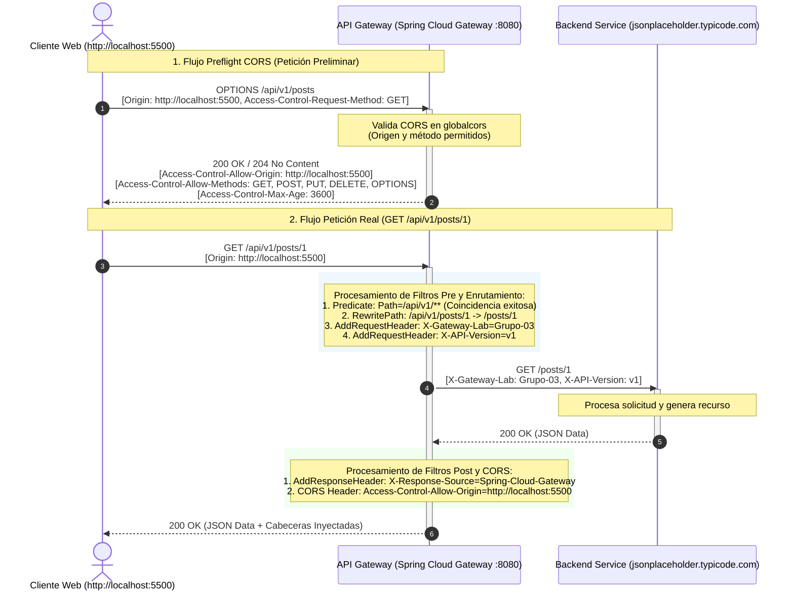

# Documentación de Evidencias - Laboratorio 1: API Gateway con Spring Cloud Gateway
**Asignatura:** DSY1107 - Arquitectura Cloud Native  
**Rama:** `feature/cors`  

---

## Parte E: Configuración y Análisis de CORS

### 1. Configuración de CORS Global en `application.yml`

Se configuró el soporte de CORS a nivel global dentro de Spring Cloud Gateway para interceptar todas las rutas (`[/**]`), permitiendo peticiones desde el frontend local (`http://localhost:5500`) y gestionando adecuadamente las solicitudes de preflight (`OPTIONS`).

```yaml
server:
  port: 8080

spring:
  application:
    name: api-gateway
  cloud:
    gateway:
      routes:
        - id: posts-v1-route
          uri: https://jsonplaceholder.typicode.com
          predicates:
            - Path=/api/v1/**
          filters:
            - RewritePath=/api/v1/(?<segment>.*), /${segment}
            - AddRequestHeader=X-Gateway-Lab, Grupo-03
            - AddRequestHeader=X-API-Version, v1
            - AddResponseHeader=X-Response-Source, Spring-Cloud-Gateway

        - id: posts-v2-route
          uri: https://jsonplaceholder.typicode.com
          predicates:
            - Path=/api/v2/**
          filters:
            - RewritePath=/api/v2/(?<segment>.*), /${segment}
            - AddRequestHeader=X-Gateway-Lab, Grupo-03
            - AddRequestHeader=X-API-Version, v2
            - AddResponseHeader=X-Response-Source, Spring-Cloud-Gateway

      globalcors:
        cors-configurations:
          '[/**]':
            allowed-origins:
              - "http://localhost:5500"
            allowed-methods:
              - GET
              - POST
              - PUT
              - DELETE
              - OPTIONS
            allowed-headers:
              - "*"
            allow-credentials: false
            max-age: 3600
```

---

### 2. Verificación de Petición Preflight con cURL

Para verificar que el API Gateway responde correctamente a la negociación de CORS sin reenviar la petición preflight al backend, se ejecuta el siguiente comando:

#### Comando de prueba (PowerShell / Terminal):
```powershell
curl -i -X OPTIONS http://localhost:8080/api/v1/posts `
  -H "Origin: http://localhost:5500" `
  -H "Access-Control-Request-Method: GET" `
  -H "Access-Control-Request-Headers: Content-Type"
```

#### Headers de respuesta esperados:
* **`HTTP/1.1 200 OK`** (o `HTTP/1.1 204 No Content`): Código de estado exitoso para la solicitud OPTIONS.
* **`Access-Control-Allow-Origin: http://localhost:5500`**: Confirma que el origen solicitante está autorizado.
* **`Access-Control-Allow-Methods: GET, POST, PUT, DELETE, OPTIONS`**: Lista los verbos HTTP permitidos.
* **`Access-Control-Allow-Headers: *`** (o `Content-Type`): Valida que las cabeceras solicitadas son aceptadas.
* **`Access-Control-Max-Age: 3600`**: Indica al navegador que puede almacenar en caché el resultado del preflight durante 3600 segundos (1 hora).

---

### 3. Preguntas de Análisis Teórico sobre CORS

#### 1. ¿Por qué Postman podía realizar las peticiones con éxito aunque el navegador fallara antes de configurar CORS?
> **Respuesta:**  
> **CORS (Cross-Origin Resource Sharing)** es una política de seguridad del lado del cliente aplicada e impuesta **exclusivamente por los navegadores web** como parte de la *Same-Origin Policy (SOP)*.  
> Herramientas como Postman, cURL o clientes HTTP de backend no son navegadores; actúan como clientes HTTP directos sin motor de renderizado ni restricciones de origen cruzado, por lo que ignoran los encabezados CORS y procesan las respuestas directamente sin bloquearlas.

#### 2. ¿Qué es exactamente una petición preflight (OPTIONS) y cuál es su objetivo?
> **Respuesta:**  
> Una petición **Preflight** es una solicitud HTTP preliminar que envía el navegador utilizando el método **`OPTIONS`** antes de enviar la petición real, siempre que esta última no sea considerada "simple" (por ejemplo, si utiliza métodos como `PUT`, `DELETE`, o headers como `Content-Type: application/json` / `Authorization`).  
> **Su objetivo** es consultar al servidor si el origen (`Origin`), el método HTTP (`Access-Control-Request-Method`) y los headers (`Access-Control-Request-Headers`) están permitidos antes de ejecutar la acción real, protegiendo así al servidor de recibir operaciones que el cliente no tiene permiso de ejecutar.

#### 3. ¿CORS autentica usuarios?
> **Respuesta:**  
> **No.** CORS no es un mecanismo de autenticación. No valida identidades, contraseñas, tokens JWT ni sesiones de usuario. CORS únicamente determina si un **origen web** (combinación de esquema, dominio y puerto) tiene permiso para que el navegador comparta los datos de la respuesta con el código JavaScript solicitante.

#### 4. ¿CORS autoriza operaciones de negocio?
> **Respuesta:**  
> **No.** CORS no gestiona roles ni permisos de negocio (RBAC). Una política de CORS permisiva o restrictiva no valida si un usuario tiene privilegios para realizar una compra, eliminar un recurso o consultar información privada. El control de acceso a nivel de negocio debe implementarse siempre en el backend o en filtros de seguridad dedicados en el Gateway mediante tokens de autorización y validación de claims/roles.

#### 5. ¿Qué problema tendría permitir cualquier origen (`*`) de forma indiscriminada en producción?
> **Respuesta:**  
> Permitir el comodín `*` en entornos de producción expone la API a riesgos de seguridad críticos:
> 1. Cualquier sitio web malicioso de terceros podría ejecutar peticiones hacia nuestra API desde el navegador de un usuario legítimo y leer las respuestas.
> 2. Si la API maneja endpoints privados o si se relajan los controles de credenciales, se facilita la exfiltración de datos sensibles y ataques basados en CSRF (*Cross-Site Request Forgery*) o lectura no autorizada de respuestas cross-origin.  
> Por ello, en producción se debe restringir explícitamente el `allowed-origins` a los dominios autorizados de la organización.

---

## Parte F: Diagrama de Arquitectura y Recorrido de Petición

### 1. Diagrama de Secuencia en Mermaid



---

### 2. Explicación Paso a Paso del Recorrido: `GET /api/v1/posts/1`

A continuación se detalla el ciclo de vida completo de la petición:

1. **Emisión de la Petición:**
   - El cliente (navegador ejecutando el frontend en `http://localhost:5500`) envía una solicitud HTTP con método `GET` al endpoint `http://localhost:8080/api/v1/posts/1`, incluyendo la cabecera `Origin: http://localhost:5500`.

2. **Evaluación del Predicado (Predicate Matching):**
   - El componente de enrutamiento de Spring Cloud Gateway evalúa los predicados de las rutas configuradas en orden. La ruta `posts-v1-route` contiene el predicado `Path=/api/v1/**`, el cual coincide exitosamente con la URI solicitada.

3. **Ejecución de Filtros "Pre" (Manipulación de Solicitud):**
   - **Reescritura de Ruta (`RewritePath`):** El filtro transforma la ruta `/api/v1/posts/1` eliminando el prefijo `/api/v1`, reescribiéndola como `/posts/1`.
   - **Inyección de Cabeceras (`AddRequestHeader`):** Se agregan las cabeceras requeridas a la petición:
     - `X-Gateway-Lab: Grupo-03`
     - `X-API-Version: v1`

4. **Reenvío al Backend (Forwarding):**
   - El Gateway actúa como proxy inverso y envía la solicitud HTTP transformada al servidor backend de destino (`https://jsonplaceholder.typicode.com/posts/1`) con las nuevas cabeceras inyectadas.

5. **Procesamiento en el Backend y Respuesta:**
   - El backend recibe la solicitud en `/posts/1`, recupera la publicación con ID 1 y devuelve una respuesta HTTP `200 OK` con el payload JSON correspondiente.

6. **Ejecución de Filtros "Post" y Validación de CORS:**
   - **Inyección de Cabecera de Respuesta (`AddResponseHeader`):** El Gateway añade a la respuesta `X-Response-Source: Spring-Cloud-Gateway`.
   - **Inyección de Encabezados CORS:** El filtro `globalcors` valida que el origen `http://localhost:5500` está autorizado e inyecta la cabecera `Access-Control-Allow-Origin: http://localhost:5500`.

7. **Entrega al Navegador:**
   - El cliente recibe la respuesta final con estado `200 OK`, los datos JSON del post y las cabeceras correspondientes, permitiendo al navegador entregar los datos a la aplicación frontend sin bloqueos de seguridad.
