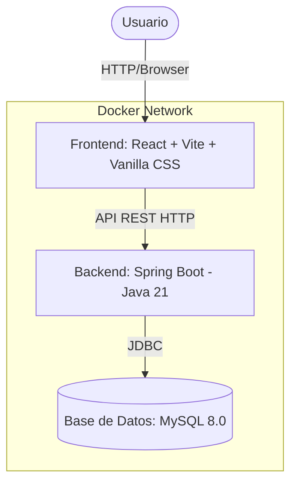

# Arquitectura del Sistema — Mini Help Desk

El sistema está diseñado siguiendo una arquitectura de tres capas contenerizada, permitiendo un desacoplamiento claro entre el cliente, la lógica de negocio y el almacenamiento de datos.

## Componentes del Sistema

### 1. Capa de Presentación (Frontend)
- **Tecnología:** React 18+ estructurado con Vite para una recarga rápida en desarrollo y compilación optimizada en producción.
- **Estilos:** CSS nativo (Vanilla CSS) organizado con variables HSL personalizadas, diseño responsivo (Grid/Flexbox) y transiciones fluidas.
- **Servidor de Producción:** Servido a través de una imagen ligera de **Nginx** en Docker, actuando como servidor estático.
- **Puerto expuesto:** `3000` (mapeado al puerto 80 del contenedor Nginx).

### 2. Capa de Lógica de Negocio (Backend)
- **Tecnología:** Java 21 con Spring Boot 4.0.0.
- **Estructura Interna:** Patrón de capas convencional de Spring:
  - **Controller:** Expone los endpoints REST bajo el prefijo `/api/incidencias`.
  - **Service:** Contiene las reglas de negocio, validaciones y orquestación de operaciones.
  - **Repository:** Interfaz JPA que gestiona las consultas a la base de datos MySQL.
  - **Model:** Entidad de persistencia `Incidencias.java`.
- **Puerto expuesto:** `8080`.

### 3. Capa de Persistencia (Base de Datos)
- **Tecnología:** Servidor MySQL 8.0.
- **Persistencia Física:** Gestionada a través de un volumen persistente de Docker Compose (`db_data`), lo que garantiza que los datos sobrevivan a la detención y recreación de contenedores.
- **Puerto expuesto interno:** `3306`. No se expone al host para producción por seguridad, a menos que se requiera para depuración.

## Comunicación y Redes en Docker Compose

Todos los componentes corren dentro de la misma red virtual creada por Docker Compose. Esto permite que:
- El **Frontend** se comunique con el **Backend** usando la URL expuesta por el host, o bien configurada mediante variables de entorno en el cliente (ej. `http://localhost:8080`).
- El **Backend** se comunique con la **Base de Datos** utilizando el nombre de host del servicio Docker `db` en lugar de `localhost` (ej. `jdbc:mysql://db:3306/gestion_incidencias`).
